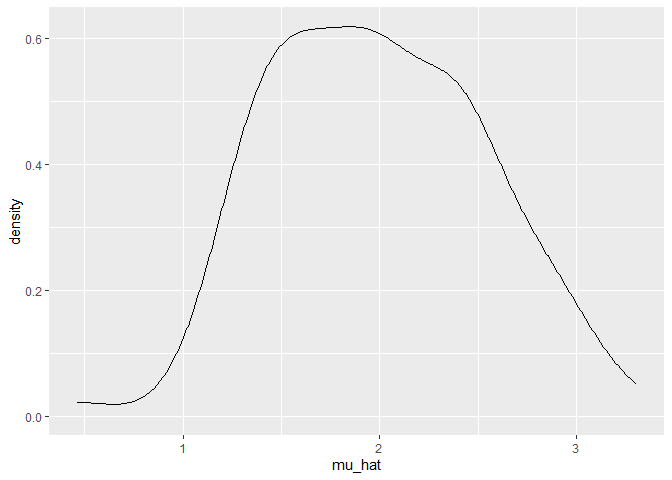
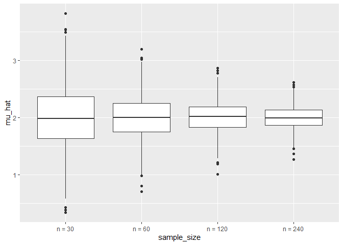
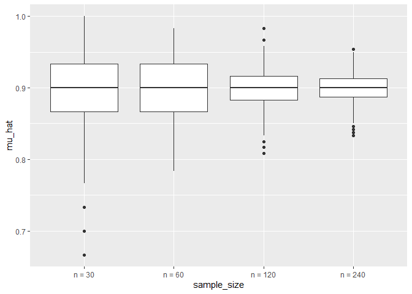

simulations
================
Lucia Wang
2023-11-02

## simulate sample mean and sd

``` r
sim_mean_sd = function(n, mu = 2, sigma = 3) {
  
  sim_data = tibble(
    x = rnorm(n, mean = mu, sd = sigma),
  )
  
  sim_data |> 
    summarize(
      mu_hat = mean(x),
      sigma_hat = sd(x)
    )
}

sim_mean_sd(n=30)
```

    ## # A tibble: 1 × 2
    ##   mu_hat sigma_hat
    ##    <dbl>     <dbl>
    ## 1   2.24      2.81

if we want to run it iteratively… lets put the results into dataframe
with a loop.

in the past we defined an input and output:

``` r
output= vector("list", length=100)

for (i in 1:100) {
  
  output[[i]] = sim_mean_sd(n=30)
  
}

sim_results = bind_rows(output)

sim_results |> ggplot(aes(x=mu_hat)) + geom_density()
```

<!-- -->

do it with a map function if you are iterating multiple times? input =
true sample size iterate = number of times

``` r
sim_result_df = 
  expand_grid(
    sample_size = 30,
    iter = 1:100 # makes a simple table of 100 rows with value 30 as the 1st col
  ) |>
  mutate(
    estimate_df = map(sample_size, sim_mean_sd) #different df per row
  ) |>
  unnest(estimate_df) #takes the dfs out
```

what about multiple iterations?

``` r
sim_result2_df = 
  expand_grid(
    sample_size = c(30,60,120, 240), #now theres 100 rows PER sample size
    iter = 1:1000 # should end up with 4000 rows in the final 
  ) |>
  mutate(
    estimate_df = map(sample_size, sim_mean_sd)
  ) |>
  unnest(estimate_df) 

sim_result2_df |> 
  mutate(sample_size = str_c("n = ", sample_size),
         sample_size = fct_inorder(sample_size)) |>
  ggplot(aes(x=sample_size, y=mu_hat)) + geom_boxplot()
```

<!-- -->

using rbinom

``` r
sim_mean_sd2 = function(n_obs, true_p = .9) {
  
  sim_data = tibble(
    x = rbinom(n=n_obs, size = 1, prob = true_p),
  )
  
  sim_data |> 
    summarize(
      mu_hat = mean(x),
      sigma_hat = sd(x)
    )
}

sim_result3_df = 
  expand_grid(
    sample_size = c(30,60,120, 240), #now theres 100 rows PER sample size
    iter = 1:1000 # should end up with 4000 rows in the final 
  ) |>
  mutate(
    estimate_df = map(sample_size, sim_mean_sd2)
  ) |>
  unnest(estimate_df) 

sim_result3_df |> 
  mutate(sample_size = str_c("n = ", sample_size),
         sample_size = fct_inorder(sample_size)) |>
  ggplot(aes(x=sample_size, y=mu_hat)) + geom_boxplot()
```

<!-- -->
